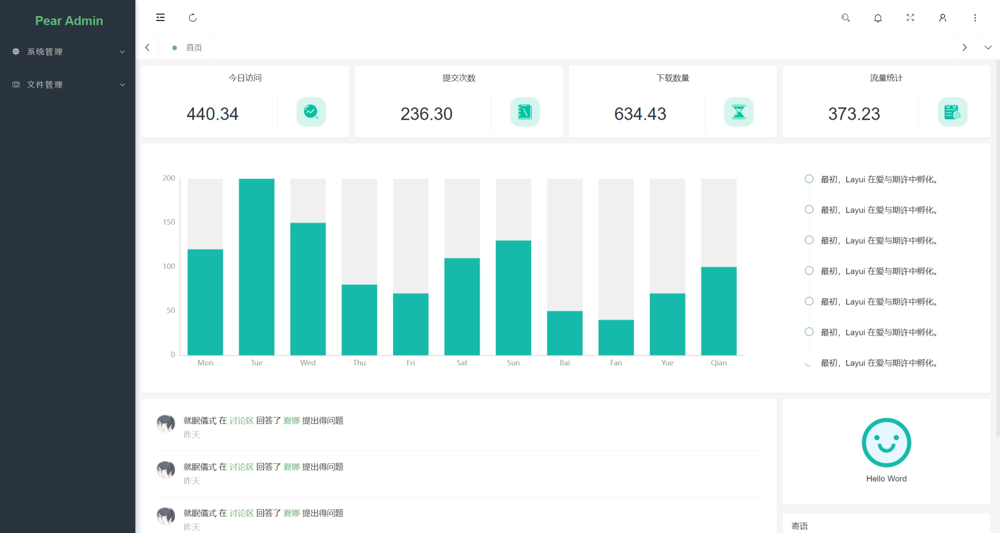
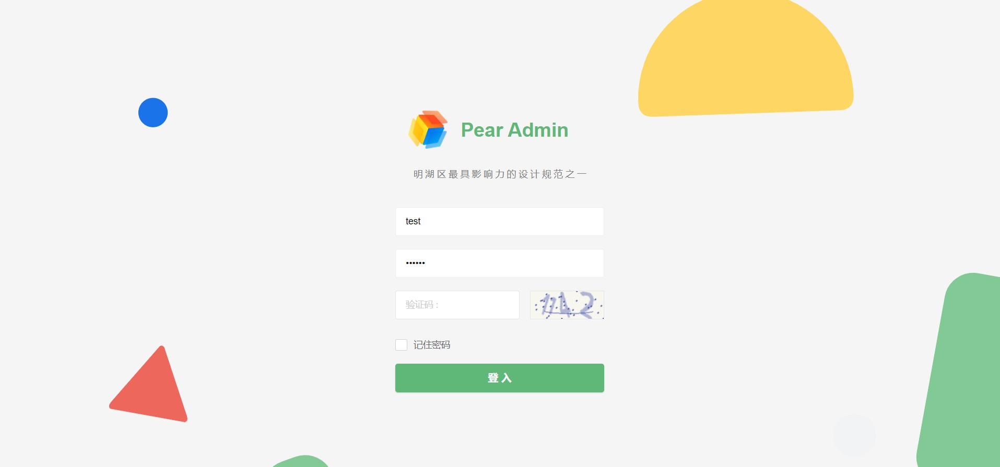

<div align="center">
<br/>
<br/>
  <h1 align="center">
    Pear Admin Flask
  </h1>
  <h4 align="center">
    开 箱 即 用 的 Flask 快 速 开 发 平 台
  </h4>

  [预览](https://pear.lovepikachu.top/)   |   [官网](http://www.pearadmin.com/)   |   [群聊](docs/source/_static/qqgroup.jpg)   |   [文档](https://lab.lovepikachu.top/document/pear-admin-flask)

<p align="center">
    <a href="#">
        
    </a>
    <a href="#">
        
    </a>
      <a href="#">
        
    </a>
</p>
</div>

<div align="center">
  
</div>

# 项目简介

> **⚠️注意** Pear Admin Flask 已同步主项目 Pear Admin Layui 4.0，部分页面变化较大，如果是从旧的框架迁移，请查阅 [从旧项目迁移](https://lab.lovepikachu.top/document/pear-admin-flask/welcome/migration.html) 章节。另外，可以在此查看 [更新日志](https://lab.lovepikachu.top/document/pear-admin-flask/welcome/update.html#v2-0-0-4-0-5) 。

Pear Admin Flask 基于 Flask 的后台管理系统，拥抱应用广泛的python语言，通过使用本系统，即可快速构建你的功能业务
项目旨在为 python 开发者提供一个后台管理系统的模板，可以快速构建信息管理系统。

项目使用 flask-sqlalchemy + 权限验证 + marshmallow 序列化与数据验证，以此方式集成了若干不同的功能。

# 内置功能

- [x] 用户管理：用户是系统操作者，该功能主要完成系统用户配置。
- [x] 权限管理：配置系统菜单，操作权限，按钮权限标识等。
- [x] 角色管理：角色菜单权限分配。
- [x] 操作日志：系统正常操作日志记录和查询；系统异常信息日志记录和查询。
- [x] 登录日志：系统登录日志记录查询包含登录异常。
- [x] 服务监控：监视当前系统CPU、内存、磁盘、python版本,运行时长等相关信息。
- [x] 文件上传:   图片上传示例

# 项目分支说明

> **⚠️注意** Pear Admin Flask 不仅仅只提供一种对于 Pear Admin 后端的实现方式，所以提供了不同的分支版本，不同分支版本各有其优劣，并且由不同的开发者维护。

| 分支名称                                                             | 特点                     |
|------------------------------------------------------------------|------------------------|
| master（您目前浏览的分支版本）                                               | 功能齐全，处于开发阶段，代码量较大。     |
| [main](https://gitee.com/pear-admin/pear-admin-flask/tree/main/) | 功能精简，代码量小，处于开发阶段，易于维护。 |
| [mini](https://gitee.com/pear-admin/pear-admin-flask/tree/mini/)    | 不再更新，是最初版本的镜像。         |


> **⚠️注意** 由于 master 分支项目需要，暂时移除了 Flask-APScheduler 定时任务 功能。

# 版本支持情况

经过测试，此项目的（master分支）运行要求是 `>= Python 3.8` ，推荐使用 `Python 3.11`。

> **💡提示** 由于 Flask 中使用的 Werkzeug 模块更新，Flask 官方并未进行更新，所以可能会出现 ImportError 。
> 此类情况的出现可以通过正确安装 `requirements.txt` 中的模块（以及其对应版本）解决。

# 项目结构

## 应用结构

```应用结构
Pear Admin Flask (master)
├─applications  # 项目核心模块
│  ├─common  # 公共模块（初始化数据库、公用函数）
│  ├─extensions  # 注册项目插件
│  ├─schemas  # 序列化模型
│  ├─models  # 数据库模型
│  ├─views  # 视图部分
│  ├─config.py  # 项目配置
│  └─__init__.py  # 项目初始化入口
├─docs  # 文档说明
├─static  # 静态资源文件
├─templates  # 静态模板文件
└─app.py  # 程序入口
```

## 资源结构

```资源结构
Pear Admin Flask
├─static    # 项目设定的 Flask 资源文件夹
│  ├─admin    # pear admin flask 的后端资源文件（与 pear admin layui 同步）
│  ├─index    # pear admin flask 的前端资源文件
│  └─upload     # 用户上传保存目录
└─templates # 项目设定的 Flask 模板文件夹
  ├─admin   # pear admin flask 的后端管理页面模板
  │  ├─admin_log    # 日志页面
  │  ├─common       # 基本模板页面（头部模板与页脚模板）
  │  ├─console      # 系统监控页面模板
  │  ├─dept         # 部门管理页面模板
  │  ├─dict         # 数据字典页面模板
  │  ├─mail         # 邮件管理页面模板
  │  ├─photo        # 图片上传页面模板
  │  ├─power        # 权限（菜单）管理页面模板
  │  ├─role         # 角色管理页面模板
  │  ├─task         # 任务设置页面模板
  │  └─user         # 用户管理页面模板
  ├─errors  # 错误页面模板
  └─index   # 主页模板
```

# 项目安装

## 从仓库获取

```bash
# 克隆仓库 / 手动下载
git clone https://gitee.com/pear-admin/pear-admin-flask
cd pear-admin-flask  # 进入到项目目录
```

## 修改配置

> **💡提示** 配置文件位于  `applications/config.py` ，打开配置文件看到的是位于 `BaseConfig` 类下的默认配置文件，您可以编写自己的配置类并继承 `BaseConfig` 类。
项目启动时，会调用 `applications/__init__.py` ，这个文件中加载了程序的配置，所以在您编写了自己的类后不要忘记在文件 `applications/__init__.py` 中修改使用的配置类。

> **⚠️注意** 配置文件中对于数据库的配置有所更改，请查看代码中的注释修改配置。

```python
# 部分配置信息如下所示

# 验证密钥（⚠️ 一定要记得修改 ⚠️）
SECRET_KEY = "pear-system-flask"

# 数据库的配置信息
SQLALCHEMY_DATABASE_URI = 'sqlite:///../pear.db'

# 默认日志等级
LOG_LEVEL = logging.WARN

# flask-mail配置
MAIL_SERVER = 'smtp.qq.com'
MAIL_USE_TLS = False
MAIL_USE_SSL = True
MAIL_PORT = 465
MAIL_USERNAME = '123@qq.com'
MAIL_PASSWORD = 'XXXXX'  # 生成的授权码
MAIL_DEFAULT_SENDER = MAIL_USERNAME
```


## 虚拟环境安装项目（推荐）

> **💡提示** 为了保证项目所依赖的库不影响其他部署在同一主机上的项目，我们推荐使用虚拟环境安装。

```bash
python -m venv venv

# 进入虚拟环境下
venv\Scripts\activate.bat  # Windows 提示命令符
venv\Scripts\Activate.ps1  # Windows Powershell
source venv/bin/activate  # Linux

# 使用 pip 安装
pip install -r requirements.txt
```

## 直接安装项目

```bash
# 使用 pip 安装
pip install -r requirements.txt
# 同时你可以选择以模块的方式调用 pip
python -m pip install -r requirements.txt
```

# 运行项目

+ 一般情况运行项目

```bash
# 初始化数据库
flask db init
flask db migrate
flask db upgrade
flask admin init

# 运行项目
flask --app app.py run -h 0.0.0.0 -p 8000 --debug

# 或者直接调用 app.py
python app.py
```

+ 使用 docker-compose 运行项目

```bash
git clone https://gitee.com/pear-admin/pear-admin-flask

# 安装 docker-compose 
curl -L https://github.com/docker/compose/releases/download/1.26.2/docker-compose-`uname -s`-`uname -m` > /usr/local/bin/docker-compose
chmod +x /usr/local/bin/docker-compose
ln -s /usr/local/bin/docker-compose /usr/bin/docker-compose 

# 运行如下命令，有输出版本，表示 docker-compose 可以用了
docker-compose --version 

# 在当前目录执行如下命令即可以运行 app
docker-compose -f dockercompose.yaml up

# 看到如下表示运行成功，由于 pip 下载慢，需要一些时间，请耐心等待；如果安装失败，重新执行上面的命令即可。

# 运行后在浏览器访问 127.0.0.1:5000 

#如果要停止容器运行，在当前文件夹执行如下命令：
docker-compose -f dockercompose.yaml down
```


# 预览项目

|                        |                        |
| ---------------------- | ---------------------- |
|  |  |
|  |  |


# 其他说明

## 项目初始用户以及其密码

默认用户为 `admin` ，密码默认为 `123456` 。


