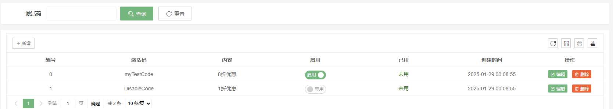

前端页面编写
========================

Pear Admin Flask 并没有实现前后端分离，因为存在部分页面的数据是直接通过模板渲染的方式直接渲染在 HTML 中的。但我们将展示给用户浏览器里的页面都称为前端。

公用模板文件
--------------------

项目使用 Flask 搭建，其所有模板文件均存放在 `templates` 文件夹中。公用模板文件保存在 `templates/system/common` ，分别是：

* header.html  --  头部包含文件，包含了后台页面通用的 css 文件
* footer.html  --  页脚包含文件，包含了后台页面通用的 js 文件

在写后台内嵌页面时，可以参考下面的模板：

.. code-block:: html

    <!DOCTYPE html>
    <html>
    <head>
        <title>这是标题</title>
          <!-- 组件式嵌入不需要这行 -->
        <!-- 这里可以包含其他文件 -->
    </head>

    <body class="pear-container">
    <!-- 正文内容 -->
    </body>

      <!-- 组件式嵌入不需要这行 -->
    
    </html>

.. note::

    需要注意的是，`header.html` 和 `footer.html` 包含了主题色和夜间模式切换的脚本，如果不想包含这两个文件的话，
    还想进行主题色和夜间模式切换可能需要自行添加脚本。（可以参考这两个文件中的内容）

正确的后台页面嵌入方式
-----------------------

Pear Admin Layui 主项目更新之后，提供了 组件式嵌入（_component） 和 iframe嵌入（_iframe） 两种方式。在编写前端页面时，
不同的嵌入方式有所不同，各有优劣。

对于组件式嵌入，可以提供更良好的用户体验，如果页面不存在则会弹出 404 提示信息，对于iframe嵌入，则会直接打开（即使不存在）。

.. important::
    **使用组件式嵌入时，上述的参考模板不在需要包含 header.html 和 footer.html 文件，如果包含这两个文件会直接影响到后台框架页面的排版和脚本调用！**

经过测试，组件式嵌入仅适合于唯一且静态的页面，不建议在其中 **添加事件绑定的脚本** ，因为组件式嵌入会将页面内容直接嵌入 div 元素中，
并动态执行脚本，但是执行的脚本绑定的事件并不会因为页面关闭而销毁。简单说明就是，假设脚本中存在计时器，计时器不会在组件式嵌入的页面销毁之后而销毁。

所以在 Pear Admin Flask 项目中，仅首页（后台数据统计页面）和个人资料页面使用组件式嵌入，其余均使用iframe嵌入。

关于主题色和夜间模式
-----------------------

如果开发的是后台管理页面，主题色和夜间模式是必要的，这样可以增加观感。
Pear Admin Layui 的控制主题色逻辑是通过设置全局的 css 属性：`--global-primary-color`

比如对于 `.layui-btn` ：

.. code-block:: css

    .layui-btn {
        background-color: var(--global-primary-color);
    }

所以，如果您添加了自定义元素，并想要其跟随主题色变化，请确保引用了 `--global-primary-color` 属性。

对于夜间模式，本质上就是修改 body 的 class ，使其添加上 `pear-admin-dark` ，比如 `.layui-btn` 的夜间模式 css 为：

.. code-block:: css

    .pear-admin-dark .layui-btn {
        color: #ffffff;
        border-color: #4C4D4F;
    }

.. _简单前端页面示例:

简单前端页面示例
-------------------------

此部分我们来以制作一个兑换码管理的前端页面为例。

.. note::

    配套后端的制作可以查看 :ref:`后端页面编写` 章节。

规划模板存放位置
~~~~~~~~~~~~~~~~~~

模板一般存放在 `templates/system` 的目录下，该目录下的每一个子文件（夹）都是一个特定功能的实现的网页模板。

我们在其中创建一个 `gift` 文件夹，并放入 `main.html` 、`add.html` 和 `edit.html` 。

|

|

加入动态表格与查询表单
~~~~~~~~~~~~~~~~~~~~~~~~

随后，我们可以制作一个写一个简单的页面，设想是页面中存在一个查询表单和一个动态表格：

.. code-block:: html

    <!DOCTYPE html>
    <html>
    <head>
        <title>兑换码管理</title>
        
    </head>
    <body class="pear-container">

    {# 查询表单 #}
    

        

            <form class="layui-form" action="" lay-filter="query-form">
                

                    <label class="layui-form-label">激活码</label>
                    

                        <input type="text" name="key" placeholder="" class="layui-input">
                    

                    <button class="layui-btn layui-btn-md" lay-submit lay-filter="gift-query">
                        <i class="layui-icon layui-icon-search"></i>
                        查询
                    </button>
                    <button type="reset" class="layui-btn layui-btn-primary layui-btn-md">
                        <i class="layui-icon layui-icon-refresh"></i>
                        重置
                    </button>
                

            </form>
        

    

    {# 用户表格 #}
    

        

            

                <table id="gift-table" lay-filter="gift-table"></table>
            

        

    

    </body>

    <!-- 这里写的都是表格一行元素组件 -->
    
        

        

        
    

    

    <!-- 这里是表格的工具栏 -->
    

    
    

    </html>

注意还要在 Python 中加上渲染路由：

.. code-block:: python

    @bp.get('/')
    @authorize("system:gift:main")
    def index():
        return render_template('system/gift/main.html')

前端的效果如下：

|

|

完善查询功能
~~~~~~~~~~~~~~~~~~~~~~~

.. note::

    查询数据库的视图函数可以参考 :ref:`编写数据获取路由` 章节。

接着，我们完善查询功能，确保获取的路由在有查询功能之后，我们在前端编写表单提交的处理。

.. code-block:: javascript

    layui.use(['table', 'form'], function () {
        ...
        let form = layui.form;

        ...
        // 表单查询
        form.on('submit(gift-query)', function (data) {
            table.reload('gift-table', {where: data.field})
            return false;
        })
    }

监听启用和禁用事件
~~~~~~~~~~~~~~~~~~~~~~~~~~

在动态表格中存在启用与禁用的切换开关，我们需要对开关进行监听，在用户切换开关状态时，自动在数据库中设置兑换码的启用与禁用状态。

.. note::

    后台视图函数，参考 :ref:`编写启用与禁用视图函数` 章节。

.. code-block:: python

    let $ = layui.jquery;
    ley popup = layui.popup;
    ...

    // 启用与禁用
    form.on('switch(gift-enable)', function (obj) {
        let operate;
        if (obj.elem.checked) {
            operate = 'enable'
        } else {
            operate = 'disable'
        }
        let loading = layer.load()
        $.ajax({
            url: '/system/gift/' + operate,
            data: JSON.stringify({id: this.value}),
            dataType: 'json',
            contentType: 'application/json',
            type: 'put',
            success: function (result) {
                layer.close(loading)
                if (result.success) {
                    popup.success(result.msg)
                } else {
                    popup.failure(result.msg)
                }
            }
        })
    })

.. important::

    如果对前端编写存在问题，可以自行查阅 `layui 官方文档 <https://layui.dev/>`_ ，需要注意的是，由于页面中的组件元素增多，
    最好使用准确无误的表示区分这些表单组件，以便在监听时正确绑定到事件。

监听删除数据事件
~~~~~~~~~~~~~~~~~~~~~~~~~~

删除数据事件就与监听启用禁用其实是同理的，这里直接给出代码，

.. code-block:: javascript

    // 表格各行工具事件
    table.on('tool(gift-table)', function (obj) {
        if (obj.event === 'remove') {

            layer.confirm('确定要删除该兑换码？', {icon: 3, title: '提示'}, function (index) {
                layer.close(index)
                let loading = layer.load()
                $.ajax({
                    url: '/system/gift/remove/' + obj.data['id'],
                    dataType: 'json',
                    type: 'delete',
                    success: function (result) {
                        layer.close(loading)
                        if (result.success) {
                            popup.success(result.msg, function () {
                                obj.del()
                            })
                        } else {
                            popup.failure(result.msg)
                        }
                    }
                })
            })

        } else if (obj.event === 'edit') {
            // 待定
        }
    })

编写新建与编辑页面
~~~~~~~~~~~~~~~~~~~~~~~~~~

.. note::

    对应的视图函数，可以查看 :ref:`编写增加视图函数` 章节。

编写这一部分涉及到设计表单，编辑实际上就是已经填好值的新建页面。由于目前项目暂未进行前后端分离，所以为了方便直接使用模板渲染的方式，直接将内容渲染到编辑页面上。
这就导致需要保留这两个略微有差别的页面，后续的更新，将会尝试将渲染的方式剥离项目，直接动态请求，可以实现动态分离。

此处给出表单页面基本的写法，所有的新建页面表单可以参考这个模板：

.. code-block:: html

    <!DOCTYPE html>
    <html>
    <head>
        <title>激活码管理</title>
        
    </head>
    <body>
    <form class="layui-form">
        

            

                

                    <!-- 这里填写表单元素 -->
                

            

        

        

            

                <button type="submit" class="layui-btn layui-btn-sm" lay-submit="" lay-filter="save">
                    <i class="layui-icon layui-icon-ok"></i>
                    提交
                </button>
                <button type="reset" class="layui-btn layui-btn-primary layui-btn-sm">
                    <i class="layui-icon layui-icon-refresh"></i>
                    重置
                </button>
            

        

    </form>
    
    

    </body>
    </html>

撰写表单的工作较为简单，代码如下：

.. code-block:: html

    

        <label class="layui-form-label">兑换码</label>
        

            <input type="text" name="key" lay-verify="title" autocomplete="off" placeholder="请输入兑换码"
                   class="layui-input">
        

    

    

        <label class="layui-form-label">兑换内容</label>
        

            <textarea placeholder="请输入兑换内容" name="content" class="layui-textarea"></textarea>
        

    

    

        <label class="layui-form-label">状态</label>
        

            <input type="radio" name="enable" value="1" title="开启" checked>
            <input type="radio" name="enable" value="0" title="关闭">
        

    

注意还要在管理页面加上窗口弹出的绑定：

.. code-block:: javascript

    // 顶部工具栏
    table.on('toolbar(gift-table)', function (obj) {
        if (obj.event === 'add') {
            layer.open({
                type: 2,
                title: '新增',
                shade: 0.1,
                area: ['550px', '550px'],
                content: '/system/gift/add'
            })
        }
    })

|

.. image:: ../_static/兑换码添加页面.png
   :align: center

|

现在编写编辑页面，编辑页面相较于新建页面仅有两个区别：增加了 ID 编辑框、修改了提交的地址，最重要的是将后端传入的内容渲染到页面上。

我们先编写如下的路由视图：

.. code-block:: python

    @bp.get('/edit/<int:_id>')
    @authorize("system:gift:edit", log=True)
    def edit(_id):
        gift = get_one_by_id(Gift, _id)
        return render_template('system/gift/edit.html', gift=gift)

绑定编辑事件（就是在上面 “// 待定” 的地方添加内容）：

.. code-block:: javascript

    } else if (obj.event === 'edit') {

        layer.open({
            type: 2,
            title: '修改',
            shade: 0.1,
            area: ['550px', '500px'],
            content: '/system/gift/edit/' + obj.data['id']
        })

    }

设计新表单：

.. code-block:: html

    

        <label class="layui-form-label">编号</label>
        

            <input type="text" name="id" lay-verify="title" autocomplete="off" placeholder="请输入编号"
                   class="layui-input" value="{{ gift.id }}" disabled>
        

    

    

        <label class="layui-form-label">兑换码</label>
        

            <input type="text" name="key" lay-verify="title" autocomplete="off" placeholder="请输入兑换码"
                   class="layui-input" value="{{ gift.key }}">
        

    

    

        <label class="layui-form-label">兑换内容</label>
        

            <textarea placeholder="请输入兑换内容" name="content" class="layui-textarea">{{ gift.content }}</textarea>
        

    

    

        <label class="layui-form-label">状态</label>
        

            <input type="radio" name="enable" value="1" title="开启" {{ 'checked' if gift.enable == 1 }}>
            <input type="radio" name="enable" value="0" title="关闭" {{ 'checked' if gift.enable == 0 }}>
        

    

.. important::

    要注意把内容渲染到网页上哦，其中 id 字段设置为禁用。随后不要忘记，将表单的提交地址改为 `/system/gift/update` 。

.. note::

    对应的视图函数，可以查看 :ref:`编写修改视图函数` 章节。

.. note::

    插件方式接入项目，请查看 :ref:`以插件的方式接入项目` 章节。

