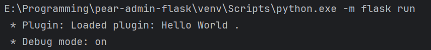
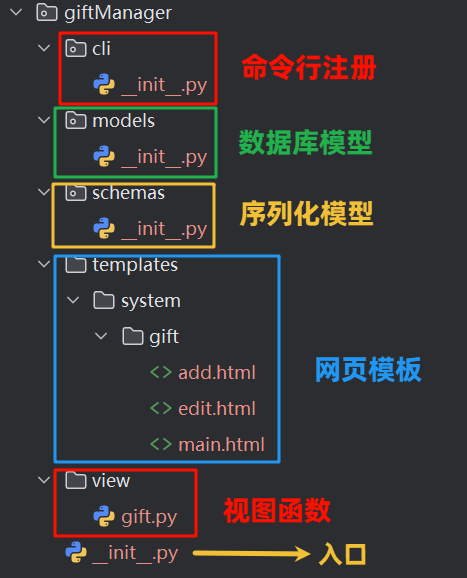
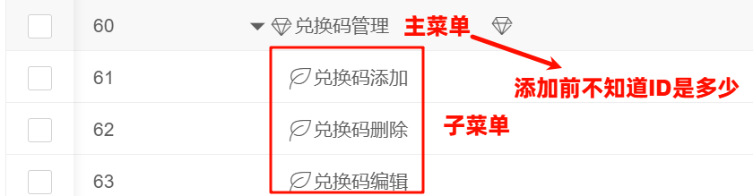

插件开发
=================

插件功能旨在最大限度不修改原框架的前提下添加新功能，并可以像程序原有框架一样进行流程注册，而且不需要修改任何程序框架原有代码（仅在配置文件中设置即可）。

所有插件放置在 `plugins` 文件夹中，项目提供了四个示例插件，分别是 `helloworld` 、 `realip` 、 `replacePage` 和 `giftManager`，
分别用于示例页面的注册、修改 Flask 上下文、页面替换和新功能接入。

像项目自带的用户管理、部门管理等基本功能属于程序自身的“功能插件”，对于大多数衍生项目来说，多的是修改字符串和删除部分不需要的功能，
而插件开发主要可以用于添加自己的视图函数和功能，可以完美于项目融合，增加可拓展性，尤其是用于既想保留原项目功能又想填写新功能的项目开发。

插件的启用
-----------------

插件需要在 `applications/config.py` 中配置，你会找到如下的内容：

.. code-block:: python

    PLUGIN_ENABLE_FOLDERS = []

而在目录 `plugins` 中，你会发现存在 文件夹名称 为 `helloworld` 、 `realip` 、 `replacePage` 和 `giftManager` 四个插件。
比如我们想要启用 `helloworld` 插件，仅需要做如下修改：

.. code-block:: python

    PLUGIN_ENABLE_FOLDERS = ["helloworld"]

假设有多个插件，只要依次在列表 `PLUGIN_ENABLE_FOLDERS` 中填入插件的文件夹名称即可。**注意：填写的先后顺序会影响插件加载的前后顺序，越前面的插件越早被加载。**

假设插件启用成功，你将会在控制台收到如下的提示：

.. code-block:: bash

    * Plugin: Loaded plugin: Hello World .

|

|

`helloworld` 插件启用之后，你可以访问 `http://127.0.0.1:5000/hello_world/` 来请求到新添加的页面。你会发现添加页面变的简单，仅需要修改一下设置项就行了。

|

|

.. note::

    对于 `giftManager` 插件，需要在启用的情况下，先使用 `flask gift init` 来初始化其数据库。假设项目已经搭建完成（已经初始化数据库），需要进行以下步骤：

    .. code-block:: bash

        flask db migrate
        flask db upgrade
        flask gift init

    该命令行用于创建新 admin_gift 表并写入数据。

插件的目录架构
-------------------

插件的目录架构如下：

.. code-block:: bash

    Plugin
    │  __init__.json
    └─ __init__.py

这是一个插件基本的目录架构，插件信息保存在 `__init__.json` 中，其本质是一个包含如下 JSON 字符串的文本文件：

.. code-block:: json

    {
      "plugin_name": "Hello World",
      "plugin_version": "1.0.0.1",
      "plugin_description": "一个测试的插件。"
    }

这个 JSON 文件中，记录了基本的插件名称与插件版本，以及插件的介绍。**在更新之后，此文件可以不存在，插件的名称默认为文件夹名。**

编写插件事件
-------------------

插件入口位于 `__init__.py` 中，一般来说请确保 `__init__.py` 文件包含 `event_init(app: Flask)` 函数，如下：

.. code-block:: python

    def event_init(app: Flask):
        pass

这个函数将会在插件加载时被调用，并传入项目的 `Flask` 对象，此后你可以像一般使用 Flask 一样添加视图函数。例如：

.. code-block:: python

    def event_init(app: Flask):
        @app.get('/test')
        def test():
            return "这是测试页面"

**当然，不推荐这样直接使用 Flask 对象创建视图函数，更妥当的做法是通过注册蓝图的方式来添加视图函数。您可以这样做：**

在您编写的插件目录下建立一个 `main.py` 文件，并在该文件中添加蓝图：

.. code-block:: python

    from flask import render_template, Blueprint

    # 创建蓝图
    helloworld_blueprint = Blueprint('hello_world', __name__,
                                     template_folder='templates',
                                     static_folder="static",
                                     url_prefix="/hello_world")

    @helloworld_blueprint.route("/")
    def index():
        return render_template("helloworld_index.html")

而后在 `__init__.py` 中注册该蓝图：

.. code-block:: python

    from flask import Flask
    from .main import helloworld_blueprint

    def event_init(app: Flask):
        """初始化完成时会调用这里"""
        app.register_blueprint(helloworld_blueprint)

这样可以使目录架构更加清晰。

另外，插件还有其他三个事件：

.. code-block:: python

    def event_begin(app: Flask):  # 在项目所有功能注册之前调用
        pass

    def event_finish(app: Flask):  # 在项目所有功能注册之后调用（插件已经加载完毕）
        pass

    def event_context(app: Flask):  # Flask 初始化完成，等待第一个请求之前，等同于 with app.app_context():
        # 此时数据库已经初始化完成，尝试读取
        pass

.. note::

    事件的时机调用可以参考 :ref:`项目初始化逻辑` 章节。

.. important::

    注意不要直接在 `__init__.py` 的函数外直接写存在阻塞的代码，不然项目 Flask 将不能初始化完成。

.. note::

    在编写插件的前端模板（template）时，请尽量将模板文件放在项目根目录的 `templates` 文件中，这样可以保持良好的项目架构。
    当然另一种做法是像 helloworld 插件那样，直接放在插件目录的 templates 中，但是一定要做好模板名称的区分，
    因为 flask 默认找模板行为是从根目录开始找的，如果根目录 templates 和插件目录的 templates 中存在的模板重名，
    则会优先使用根目录 templates 的模板文件。

.. _以插件的方式接入项目:

以插件的方式接入项目
---------------------------

在 :ref:`简单前端页面示例` 和 :ref:`后端页面编写` 章节中，我们编写了新的管理页面。接下来，我们将其改为插件接入，获得更高的拓展性。

首先在 `plugins` 新建一个名为 `giftManager` 的文件夹，将兑换码管理页面相关的功能一五一十的照搬到这个文件夹中。

我们可以规划如下的目录架构：

|

|

入口文件
~~~~~~~~~~~~~~

入口文件相对简单，

.. code-block:: python

    from flask import Flask

    from .cli import gift_cli
    from .view.gift import bp

    def event_init(app: Flask):
        app.register_blueprint(bp)

    def event_finish(app: Flask):
        app.cli.add_command(gift_cli)

在 `event_init` 事件中注册相关蓝图（页面），在 `event_finish` 中，注册了初始化数据库的命令。

注册初始化数据库命令
~~~~~~~~~~~~~~~~~~~~~~~~

一个合理的设想是，我已经搭建了 Pear Admin Flask 原项目，而之后我想要加入新的功能，新功能中存在添加权限管理等数据库的操作，
所以我们想使用其他的初始化命令，来新增数据库记录行。

.. code-block:: python

    import datetime

    from flask.cli import AppGroup

    from ..models import Gift
    from applications.models import Power
    from applications.extensions import db

    gift_cli = AppGroup("gift")

    now_time = datetime.datetime.now()

    powerdata = [
        Power(
            name='兑换码添加',
            type='2',
            code='system:gift:add',
            url='',
            open_type='',
            parent_id='60',
            icon='',
            sort=0,
            create_time=now_time,
            enable=1
        ), Power(
            name='兑换码删除',
            type='2',
            code='system:gift:remove',
            url='',
            open_type='',
            parent_id='60',
            icon='',
            sort=0,
            create_time=now_time,
            enable=1
        ), Power(
            name='兑换码编辑',
            type='2',
            code='system:gift:edit',
            url='',
            open_type='',
            parent_id='60',
            icon='',
            sort=0,
            create_time=now_time,
            enable=1
        )
    ]

    giftdata = [
        Gift(
            id=0,
            key='myTestCode',
            content='8折优惠',
            enable=1,
            used=0,
            create_at=now_time
        ),
        Gift(
            id=1,
            key='DisableCode',
            content='1折优惠',
            enable=0,
            used=0,
            create_at=now_time
        )
    ]

    @gift_cli.command("init")
    def init_db():
        print("存入兑换码管理页面数据")

        top_power = Power(
            name='兑换码管理',
            type='1',
            code='system:gift:main',
            url='/system/gift/',
            open_type='_iframe',
            parent_id='1',
            icon='layui-icon layui-icon layui-icon layui-icon-diamond',
            sort=8,
            create_time=now_time,
            enable=1
        )

        db.session.add(top_power)
        db.session.commit()  # 提交了才有 id

        for i in range(len(powerdata)):
            powerdata[i].parent_id = top_power.id

        db.session.add_all(powerdata)

        db.session.add_all(giftdata)
        db.session.commit()

上述代码中，主要说明一下 `top_power` 的做法，由于兑换码管理需要新的菜单（权限），但是新的菜单在添加之前可能已经存在了其他菜单，
我们并不知道新菜单的 ID 是什么，所以需要让主菜单（top_power）先添加，并获取到其 ID 而后才可以把子菜单添加进去。

|

|

.. note::

    要获取添加菜单的 ID 必须先 commit 一次数据库。

随后我们可以使用 `flask gift init` 来初始化兑换码管理的数据库数据。

注册蓝图
~~~~~~~~~~~~

注册蓝图部分和设计一般前端页面差不多，只不过要注意正确把模板文件夹的路径提供给蓝图进行初始化。

.. code-block:: python

    import os

    from flask import Blueprint, request, render_template

    from ..models import Gift
    from ..schemas import GiftSchema
    from applications.extensions import db

    from applications.common.helper import ModelFilter
    from applications.common.curd import enable_status, disable_status, delete_one_by_id, get_one_by_id
    from applications.common.utils.http import table_api, success_api, fail_api
    from applications.common.utils.rights import authorize

    # 获取插件所在的目录（结尾没有分割符号）
    dir_path = os.path.dirname(__file__).replace("\\", "/")

    bp = Blueprint('gift', __name__, url_prefix='/system/gift',
                   template_folder=dir_path + '/../templates')

上述代码中，获取了 `dir_path` 并指定了上一级目录的 `templates` 为该蓝图的模板文件夹。另外，对于 `url_prefix` ，在统一规划下，
我们建议将 gift 路由放在 `system` 下，在 :ref:`后端页面编写` 中，我们似乎并没有指定 `system` 这是因为当时注册蓝图的时候是在 system_bp 的蓝图中注册的：

.. code-block:: python

    system_bp = Blueprint('system', __name__, url_prefix='/system')  # 但是是在这个蓝图下注册的

    def register_system_bps(app: Flask):
        ...
        system_bp.register_blueprint(gift_bp)
        app.register_blueprint(index_bp)
        app.register_blueprint(system_bp)

我们不能通过正常方法拿到 system_bp 就只能使用指定路由在 `system` 下了，唯一的缺点就是不能使用 “system.gift.\*” 来指定路由中的函数，而是要使用 “gift.\*” .

.. code-block::

    from flask import Flask, url_for

    url_for("system.gift.index")  # 不能这样写
    url_for("gift.index")  # 要这样写

