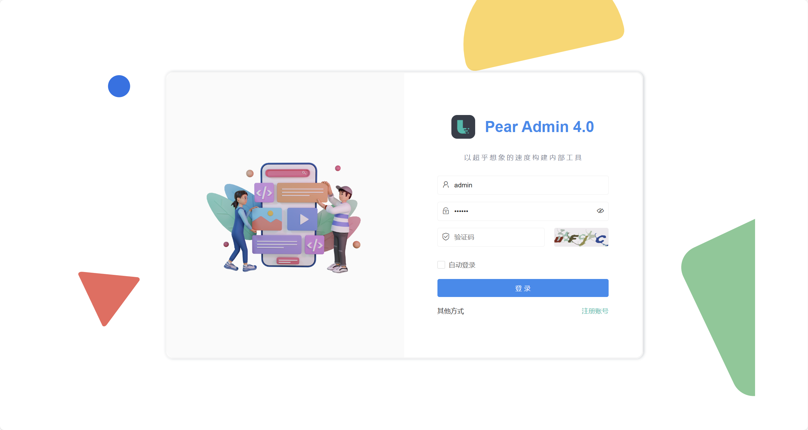

快速开始
=========================

此章节将介绍 Pear Admin Flask 搭建的方法，将会 Python 搭建与 Docker 自动构建两种方法。

克隆仓库
-----------------

.. code-block:: bash

    git clone https://gitee.com/pear-admin/pear-admin-flask
    cd pear-admin-flask  # 进入到项目目录

Python 部署
-----------------

创建虚拟环境
~~~~~~~~~~~~~~~~

推荐使用虚拟环境，如果您不想使用虚拟环境请跳过这一步。

.. code-block:: bash

    python -m venv venv

    venv\Scripts\activate.bat  # Windows 提示命令符
    venv\Scripts\Activate.ps1  # Windows Powershell
    source venv/bin/activate  # Linux

安装必要模块
~~~~~~~~~~~~~~~~

.. code-block:: bash

    # 使用 pip 安装
    pip install -r requirements.txt

    # 另外，如果上述无效，你可以选择以模块的方式调用 pip
    python -m pip install -r requirements.txt

设置配置文件
~~~~~~~~~~~~~~~~

打开文件 `applications/config.py` 进行编辑，在其中配置数据库等相关信息，默认采用的是 sqlite3 存储项目数据。

.. code-block:: python

    # 数据库的配置信息
    SQLALCHEMY_DATABASE_URI = 'sqlite:///../pear.db'

.. important::

    注意！在实际项目中一定要修改 SECRET_KEY 参数！否则存在 Cookie 中的 session 被破解的情况。

初始化数据库
~~~~~~~~~~~~~~~~

随后需要初始化数据库。

.. code-block:: bash

    flask db init
    flask db migrate
    flask db upgrade
    flask admin init

运行项目（调试模式）
~~~~~~~~~~~~~~~~~~~~~~~~~

可以使用 flask 对项目进行调试运行。此方式仅用于生产环境。

.. code-block:: bash

    flask run

    # 或者使用
    python app.py

发布项目
~~~~~~~~~~~~~~~~~~~~~~~~~

推荐使用 `gunicorn` 对项目进行发布。

.. code-block:: bash

    pip install gunicorn  # 安装 gunicorn

    # 运行项目
    gunicorn -b 0.0.0.0:5000 app:app

如果部分平台（如 Windows）不能使用 `gunicorn` 可以尝试使用 `pywsgi` 。

.. code-block:: bash

    pip install gevent  # 安装 gevent

并修改 app.py 文件为：

.. code-block:: python

    from applications import create_app

    from gevent import pywsgi

    app = create_app()

    if __name__ == '__main__':
        # app.run()
        server = pywsgi.WSGIServer(('0.0.0.0', 7000), app)
        server.serve_forever()

随后在控制台中：

.. code-block:: bash

    # 运行项目
    python app.py

Docker 部署
-------------------

设置配置文件
~~~~~~~~~~~~~~~~

打开文件 `applications/config.py` 进行编辑，在其中配置数据库等相关信息，默认采用的是 sqlite3 存储项目数据。

.. code-block:: python

    # 数据库的配置信息
    SQLALCHEMY_DATABASE_URI = 'sqlite:///../pear.db'

.. important::

    注意！在实际项目中一定要修改 SECRET_KEY 参数！否则存在 Cookie 中的 session 被破解的情况。

部署
~~~~~~~~~~~~~~~~

随后确保 docker 环境已经安装，并在控制台中输入（目录要切换到项目根目录）：

.. code-block:: bash

    docker-compose -f dockerdata/docker-compose.yaml up

.. tip::

    你可以在 `dockerdata/docker-compose.yaml` 和 `dockerdata/Dockerfile` 中调整映射的端口，和项目默认开发的端口与行为。
    容器每次重启会执行 `dockerdata/start.sh` ，故可以在其中配置 Docker 容器的系统。

浏览项目
------------------

|

|

打开 `http://127.0.0.1:5000` （在未调整端口配置的情况下），可以打开项目的登录页面，默认的用户名与密码分别为 ``admin`` 与 ``123456`` 。

.. tip::

    旧版的登录页面保留在了 `templates/system/login_old.html` 。

